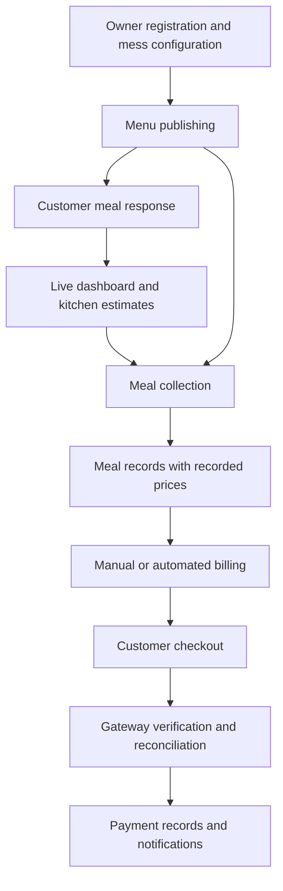
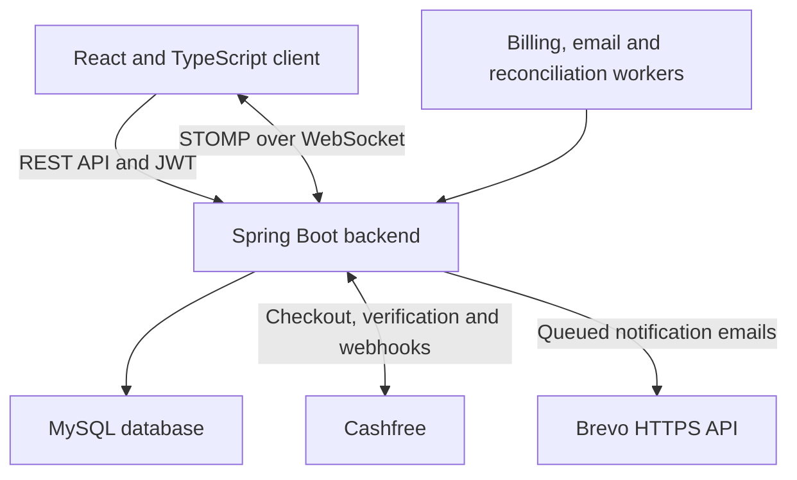
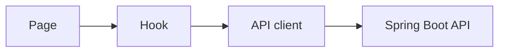

# Smart Mess

Smart Mess is a full-stack meal planning and mess operations platform designed for local mess and tiffin services. It supports multiple independent messes, with separate Owner and Customer portals and access scoped to each user's mess.

Owners manage customers, publish menus, monitor meal responses, record collections, configure schedules and pricing, generate bills, and track payments. Customers join through their mess's registration link, participate after approval, review their meal history and bills, and pay through Cashfree checkout.

The platform provides billing insights, persistent notifications, email delivery, and real-time operational updates.

## Features

### Owner Portal

- Dashboard with live meal-response summaries and kitchen preparation estimates
- Lunch and dinner menu publishing
- Mess-specific registration links and customer approval management
- Customer activation, rejection, and reactivation
- Meal-response monitoring and collection recording
- Meal collection for customers without a prior response
- Recorded meal prices preserved for billing
- Bill generation for selected customers and date ranges
- Automated billing for completed months with retryable jobs
- Payment tracking and reconciliation
- Billing and revenue insights
- Initial meal pricing and scheduled price changes
- Response-window and weekly schedule configuration
- Temporary mess closure management
- Real-time operational updates

### Customer Portal

- Register through a mess link and access the portal after approval
- View menus and accept or decline meals
- Select full or half meals and request extra rotis
- Review collected meal history
- View and download bills with meal breakdowns and payment details
- Pay through Cashfree checkout
- View mess pricing, schedules, and closures
- Receive persistent real-time notifications
- Receive email notifications for bills, payments, and pricing changes
- View profile and account information
- Access historical records, bills, and payments while inactive
- Reset forgotten passwords through email

## System Workflow



Owners configure meal prices before publishing menus. Collections can also be recorded without a prior response, and billing uses the prices stored with each collected meal.

## Architecture



The frontend uses a feature-based structure:



JWT authentication controls Owner and Customer access. Backend operations scope data to the authenticated user's mess.

## Technology Stack

### Frontend

- React 19 and TypeScript
- Vite and Tailwind CSS
- React Router
- Fetch-based API client
- React Hook Form and Zod
- STOMP and SockJS
- Framer Motion, Sonner, and Lucide React
- jsPDF and html2canvas
- pnpm

### Backend

- Java 17 and Spring Boot
- Spring Web and Spring Data JPA
- Spring Security and JWT authentication
- WebSocket messaging
- Bean Validation and MapStruct
- Scheduled workers and transaction management
- Maven

### Database and Supporting Services

- MySQL
- Cashfree Payment Gateway
- Brevo HTTPS Email API
- Render application hosting
- Aiven database hosting
- GitHub Actions

## Repository Structure

```text
smart-mess/
|-- .github/
|   `-- workflows/
|       `-- ci.yml
|-- backend/
|   |-- src/
|   |-- Dockerfile
|   |-- pom.xml
|   |-- mvnw
|   `-- mvnw.cmd
|-- client/
|   |-- public/
|   |-- src/
|   |-- .env.example
|   |-- package.json
|   `-- pnpm-lock.yaml
|-- postman/
|   |-- collections/
|   |   `-- Smart-Mess-API.postman_collection.json
|   |-- environments/
|   |   `-- Smart-Mess-Local.postman_environment.json
|   `-- README.md
|-- .gitignore
`-- README.md
```

## Prerequisites

- Java 17
- Node.js 22 or later
- pnpm
- MySQL
- Git
- Eclipse, IntelliJ IDEA, or another Java IDE (optional)

The Maven Wrapper is included; a global Maven installation is not required.

## Local Setup

### 1. Clone the repository

```bash
git clone https://github.com/saurabhdixit03/smart-mess.git
cd smart-mess
```

### 2. Create the local database

```sql
CREATE DATABASE smart_mess
    CHARACTER SET utf8mb4
    COLLATE utf8mb4_unicode_ci;
```

### 3. Configure the backend

Review the local database settings in:

```text
backend/src/main/resources/application.properties
```

```properties
spring.datasource.url=jdbc:mysql://localhost:3306/smart_mess
spring.datasource.username=your_mysql_username
spring.datasource.password=${LOCAL_DB_PASSWORD}
```

Set the following environment variables in the terminal or IDE used to start the backend:

```text
LOCAL_DB_PASSWORD
BREVO_API_KEY
MAIL_FROM
FRONTEND_URL
```

Use your local database password, Brevo API key, verified sender address, and `http://localhost:5173` as the frontend URL.

For PowerShell, environment variables can be set for the current session:

```powershell
$env:LOCAL_DB_PASSWORD = "your_local_database_password"
$env:BREVO_API_KEY = "your_brevo_api_key"
$env:MAIL_FROM = "your_verified_sender_email"
$env:FRONTEND_URL = "http://localhost:5173"
```

For optional sandbox payments, also configure:

```text
CASHFREE_ENABLED=true
CASHFREE_ENVIRONMENT=SANDBOX
CASHFREE_CLIENT_ID
CASHFREE_CLIENT_SECRET
CASHFREE_RETURN_URL=http://localhost:5173/customer/my-bills
```

Cashfree is disabled by default. A public backend URL is required to receive gateway webhooks locally.

Demo data is controlled by:

```properties
app.seed-demo-data=true
```

Set it to `false` to skip sample data. Demo records belong to a dedicated demo mess; newly registered messes configure their own meal prices.

The default application time zone is `Asia/Kolkata`.

## Running the Backend

### Option 1: Run through Eclipse

1. Import `backend` as an existing Maven project.
2. Allow Maven dependencies to download.
3. Add the required environment variables to the run configuration.
4. Run `BackendApplication` using **Run As → Spring Boot App**.

If unavailable, use **Run As → Java Application**.

### Option 2: Run through PowerShell

```powershell
cd backend
.\mvnw.cmd spring-boot:run
```

### Option 3: Run on Linux or macOS

```bash
cd backend
./mvnw spring-boot:run
```

The backend runs at `http://localhost:8080`.

## Running the Frontend

### 1. Configure the frontend environment

Copy `client/.env.example` to `client/.env` and configure:

```env
VITE_API_BASE_URL=http://localhost:8080/api
VITE_WS_URL=http://localhost:8080/ws-dashboard
```

Frontend environment variables are public build-time configuration. Do not place gateway credentials or backend secrets in them.

### 2. Install dependencies

```powershell
cd client
pnpm install
```

### 3. Start the development server

```powershell
pnpm dev
```

The frontend runs at `http://localhost:5173`.

## Build and Verification

### Frontend production build

```powershell
cd client
pnpm lint
pnpm build
```

The build checks TypeScript and creates production assets in `client/dist`.

### Backend compilation check

```powershell
cd backend
.\mvnw.cmd clean compile
```

### Backend package build

```powershell
cd backend
.\mvnw.cmd clean package
```

This compiles the backend, runs tests, and creates the application JAR under `backend/target`.

The database integration tests use the dedicated local database `smart_mess_worker_test`. Create it before running the suite and review the test datasource configuration:

```sql
CREATE DATABASE smart_mess_worker_test;
```

Integration tests recreate their test tables. Use a dedicated test database.

To package without running tests:

```powershell
.\mvnw.cmd clean package -DskipTests
```

On Linux or macOS, replace `.\mvnw.cmd` with `./mvnw`.

## Production Configuration

Production settings are defined in:

```text
backend/src/main/resources/application-prod.properties
```

### Required production variables

```text
SPRING_PROFILES_ACTIVE=prod
DB_URL
DB_USERNAME
DB_PASSWORD
JWT_SECRET
BREVO_API_KEY
FRONTEND_URL
```

### Optional production variables

```text
JWT_EXPIRATION
MAIL_FROM
PASSWORD_RESET_EXPIRATION_MINUTES
APP_TIME_ZONE
BILLING_AUTOMATION_ENABLED
NOTIFICATION_EMAILS_ENABLED
```

To enable payment checkout, configure:

```text
CASHFREE_ENABLED=true
CASHFREE_ENVIRONMENT=SANDBOX
CASHFREE_CLIENT_ID
CASHFREE_CLIENT_SECRET
CASHFREE_RETURN_URL
CASHFREE_NOTIFY_URL
```

Use sandbox credentials for test payments. Configure the return URL to the frontend's `/customer/my-bills` page and the notify URL to the backend's `/api/webhooks/cashfree` endpoint.

The backend and frontend are hosted on Render, with MySQL hosted on Aiven. Frontend API and WebSocket URLs must point to the deployed backend.

Production disables demo seeding and uses `spring.jpa.hibernate.ddl-auto=validate`. Apply database schema changes before deploying a backend that requires them, and back up existing data before migration.

## Postman API Collection

Import these files:

```text
postman/collections/Smart-Mess-API.postman_collection.json
postman/environments/Smart-Mess-Local.postman_environment.json
```

1. Start the local backend.
2. Import the collection and environment into Postman.
3. Select the imported local environment.
4. Set `baseUrl` to `http://localhost:8080/api`.
5. Follow `postman/README.md` to run the required workflows.

Regression workflows create test accounts and operational records. Use a local development database. Cashfree checkpoints require sandbox checkout steps and should be run separately from automated workflows.

Committed environment values are blank except for the local base URL. Keep populated environment exports, credentials, and tokens out of Git.

## Continuous Integration

GitHub Actions runs for pull requests targeting `main` and pushes to `main`.

### Frontend

- Installs dependencies using pnpm
- Runs the TypeScript and Vite production build

### Backend

- Sets up Java 17
- Packages the Spring Boot application
- Skips tests in the current CI package build

Run the backend test suite and frontend lint locally before merging changes.

The workflow is defined in `.github/workflows/ci.yml`.

## Security Notes

- Keep database passwords, gateway credentials, email API keys, and JWT secrets out of Git.
- Use environment variables for backend secrets.
- Use a strong, unique JWT secret in production.
- Keep local `.env` files and populated Postman exports untracked.
- Never place secrets in `VITE_*` variables.
- Payment completion is confirmed by backend gateway verification.
- Protect database backups because they can contain account and payment information.